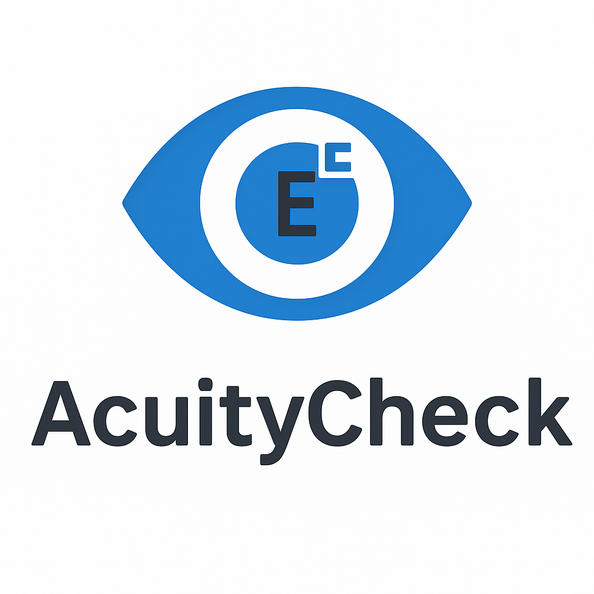

<p align="center">
  
</p>

*Indicative only - not a medical device.*

AcuityCheck is a web app that turns your webcam and screen into an **interactive visual acuity tester**.
It uses **computer vision** to estimate your **eye–screen distance** and then dynamically scales a **Snellen chart** (Sloan or Classic) to the correct physical size.


## ✨ Features

* **Screen calibration**: Use a standard credit/debit card to calibrate pixels per millimetre.
* **Automatic eye detection**: Detects face/eyes using **OpenCV YuNet**.
* **Distance estimation**: Computes **eye -> screen distance** via interpupillary distance (IPD) calibration.
* **Dynamic Snellen chart**: Supports **Sloan**, **Classic Snellen**, or **Single letter** styles.
* **Customisable chart**: Polarity, labels, letter spacing, etc.
* **Webcam integration**: Take a snapshot directly inside the app for calibration.


## ⚠️ Disclaimer

This project is for **educational and research purposes only**.
It is **not a medical device** and should **not** be used as a substitute for professional eye exams.


## 🛠️ Installation

### 1. Clone repository

```bash
git clone https://github.com/AnishrKhadka/acuitycheck.git
cd acuitycheck
```

### 4. Download models

```bash
 chmod +x ./scripts/download_models.sh
 ./scripts/download_models.sh
```

This will fetch:

* `face_detection_yunet_2023mar` (face detector, ONNX)


---

## 🚀 Usage

Run the app with:

```bash
streamlit run app.py
```
or 
```bash
docker compose up --build 
```

Then open your browser at [http://localhost:8501](http://localhost:8501).

---

## 📋 Workflow

1. **Card calibration** → Align the on-screen rectangle with your real credit/debit card.
2. **Snapshot** → Take a webcam photo. The app detects your eyes and estimates pixel IPD.
3. **Calibration** → Enter a known **camera→eye distance** once to compute focal length.
4. **Chart** → View a dynamically sized Snellen chart at the centre of the screen.

---

## 🤝 Contributing

Pull requests and suggestions are welcome. Please open an issue first for discussion.

---

## 📜 License

MIT License © 2025 AcuityCheck

